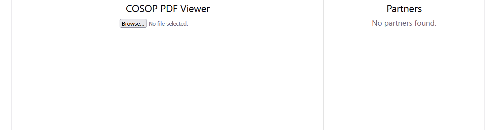
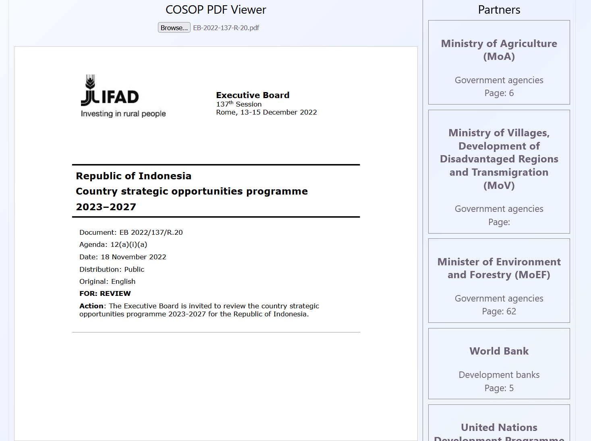
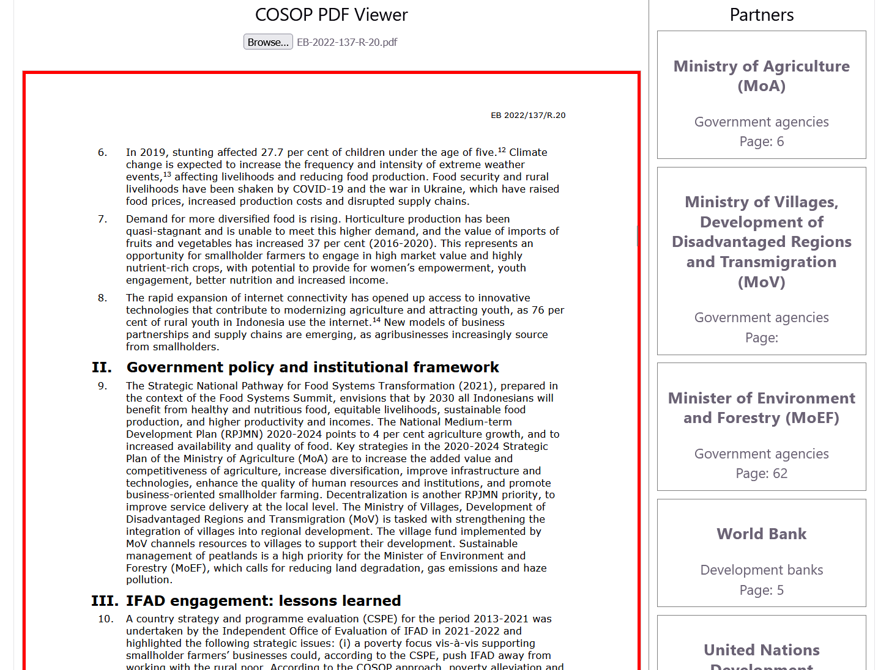

# COSOP-Viewer
IFAD COSOP Viewer extracts partners from COSOP PDFs and displays them. Upon clicking on the extracted partners, it navigates to the first appearance of the partner in the document
<p align="center">
  
</p>

# Solution Overview

COSOP-Viewer is a web application that helps users explore IFAD COSOP documents.
The application accepts a COSOP PDF in the left panel, extracts potential partner organizations using a Large Language Model (LLM), and presents them in a clickable list in the right panel. The listed partners are usually categorized according to different partners identified in the document. Selecting a partner automatically navigates the user to the first page in the document where that partner appears.

## Features
- Upload and process COSOP PDF documents
- Automatically extract development partners using an LLM
- Categorize extracted partners
- Display extracted partners in a searchable list
- Navigate directly to the page where a partner first appears
- Side-by-side PDF viewer and partner explorer
  
## Architecture
The solution consists of a React frontend and a FastAPI backend.

### Frontend:
- React
- TypeScript
- React-PDF

### Backend:
- FastAPI
- PyMuPDF
- Hugging Face / Groq LLM

# Repository Structure
- backend/
  - .env.example *(Example environment variables)*
  - main.py *(Python dependencies)*
  - requirements.txt *(FastAPI backend API)*
- frontend/
  - public/
    - pdf.worker.min.mjs *(Web Worker used by PDF.js to process and render PDFs without blocking the UI)*
  - src/
    - App.css *(Component-specific styling)*
    - App.tsx *(Main React application and user interface)*
    - index.css *(Global styling, theme, colors, and layout)*
    - main.tsx *(React application entry point)*
  - package.json *(Frontend dependencies and scripts)*
  - vite.config.ts *(Vite build configuration)*
- screenshots/
  - automatic_navigation.png
  - list_of_partners.png
  - uploading_pdf.png

# Prerequisites
- Python 3.14.4+
- Node.js 18+
- npm
- A Hugging Face Access Token or Groq API Key

# Installation
Start by cloning this repo in your terminal through the command `git clone https://github.com/thewati/COSOP-Viewer`
### Backend  
Enter the following commands in your terminal:
1. Navigate to your backend folder `cd backend`
2. Create a virtual environment using `python -m venv myvenv` where `myvenv` is the name of your new virtual environment
3. Activate the virtual environment using `source myvenv/bin/activate` (or `myvenv\Scripts\activate` on Windows)
4. Install requirements using `pip install -r requirements.txt`
5. Make a copy of the sample ".env.example" file using `cp .env.example .env`
6. Open your new `.env` file and add your API Key/Access Token. Please note that you only need one between Hugging face and Groq
    - COSOP-Viewer uses Hugging Face by default. If you are using Hugging Face, find `HF_TOKEN=HUGGING_FACE_TOKEN_PLACEHOLDER` in the file and replace "HUGGING_FACE_TOKEN_PLACEHOLDER" with your actual API Key. If you don't have an Access Token, please create an account, navigate to `Settings / Access Tokens` and create an Access Token with "Read" permissions on: https://huggingface.co/
    - If you are using Groq, find `GROQ_API_KEY=GROQ_API_KEY_PLACEHOLDER` in the file and replace "GROQ_API_KEY_PLACEHOLDER" with your actual API Key. If you don't have an API Key, please create an account and create an API Key on: https://console.groq.com/home. Please note that you will need to make modifications to the code in order to work with Groq. More on this in the "Issues / Limitations" sections
7. Run your backend using `uvicorn main:app --reload`

### Frontend
Open another terminal and Enter the following commands. Make sure the backend terminal from the previous section is still running:
1. Navigate to your frontend folder `cd frontend`
2. Download and install the necessary dependencies using `npm install`
3. Run your frontend using `npm run dev`
4. Open your browser and enter go to this url: `http://localhost:5173/`

# Screenshots
## Uploading PDF
The image below shows the frontpage. In the left panel, you can click on the `Browse` button to select a pdf. The PDF gets uploaded immediately after you confirm your selection.


## Clickable List of Partners
The image below shows the extracted list of partners in the right panel. It shows the name of the partner, followed by the category, and finally the page number where the partner is located.


## Automatic Navigation
The image below shows the result after clicking on "Ministry of Agriculture" in the right panel. The result of this is displayed in the right panel. The red rectangular border highlights the page where  "Ministry of Agriculture" is located.


# Issues and Advanced Configurations
- Currently only the first 5 pages are rendered in the PDF viewer for performance during development. Making this unlimited sometimes leads to a maximum update depth warning from React. If you want to make it unlimited, update your `frontend/src/App.tsx` as seen below:
  - Change: https://github.com/thewati/COSOP-Viewer/blob/0fe7d314528dcaf98e60f6e8f70b0cd5e2a0abe4/frontend/src/App.tsx#L124
  - To: `new Array(numPages),`
    
- Due to API inference quota contraints, I used Groq llama-3.1-8b-instant temporarily to continue improving accuracy of the COSOP-Viewer.The COSOP-Viewer works with Hugging Face by default. If you want to use Groq, then
  - First, get a Groq API Key and update the .env file accordingly. This was expained in the "Installation" section 
    
  - Then change the client in `backend/main.py`
    - Comment out or delete the Hugging Face client:
      https://github.com/thewati/COSOP-Viewer/blob/0fe7d314528dcaf98e60f6e8f70b0cd5e2a0abe4/backend/main.py#L17-L20
    - Replace it with new Groq client:
      `client = Groq(api_key=os.getenv("GROQ_API_KEY"))`
  
  - Finally, change the response in the function `query_llm()` which is in the file `backend/main.py`
    - Comment out or delete the Hugging Face response:
      https://github.com/thewati/COSOP-Viewer/blob/0fe7d314528dcaf98e60f6e8f70b0cd5e2a0abe4/backend/main.py#L52-L61
    - Replace it with new Groq response:
      ```
        response = client.chat.completions.create(
        model="llama-3.1-8b-instant",
        messages=[
            {
                "role": "user",
                "content": prompt
            }
        ],
        temperature=0,
        max_tokens=250
        )
      ```
      
- Page references are based on chunk-level extraction. Only a text chunk_size of 5,000 is used in order not to exhaust the API inference quota. If you do not want to be restricted by any API inference quota, then do the follwoing in the `backend/main.py` file:
  - Find this `chunk_size` parameter:
    https://github.com/thewati/COSOP-Viewer/blob/b44487291a387e010966783b6febf4ea8bb8decb/backend/main.py#L101
  - Change it to `15,000` as seen here: `def chunk_text(text, chunk_size=15000)`
